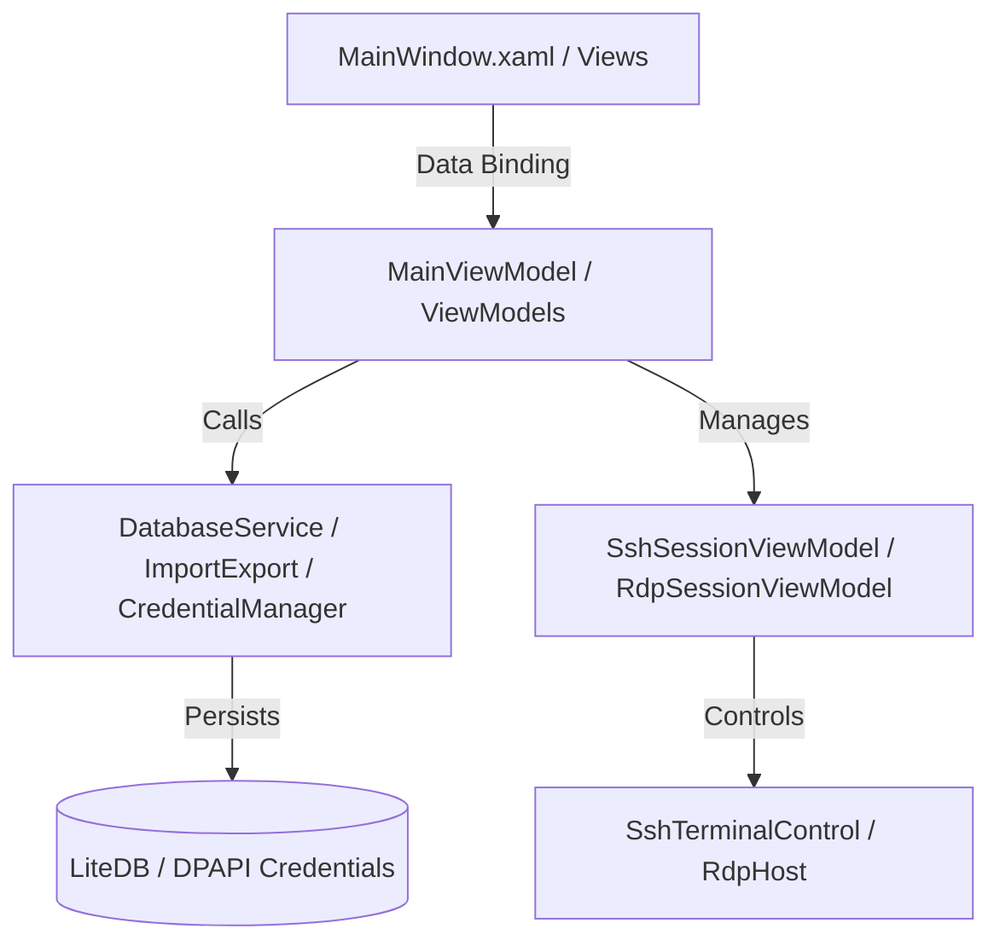

# 🖥️ RemoteManager (RDM)

[](#)
[](https://dotnet.microsoft.com/download/dotnet/8.0)
[](#)
[](#)

**RemoteManager** — це сучасний, швидкий та безпечний десктопний менеджер віддалених підключень для Windows. Додаток розроблено на базі платформи **.NET 8.0** та **WPF (Windows Presentation Foundation)** за патерном MVVM.

Він об'єднує керування RDP та SSH сесіями в одному вікні з використанням системи вкладок (Tabs), групуванням підключень та безпечним шифруванням облікових даних.

---

## 🚀 Основні можливості

*   **⚡ Керування сесіями RDP (Remote Desktop Protocol)**:
    *   Інтеграція офіційного ActiveX контролу `MsRdpClient` через `WindowsFormsHost`.
    *   **DPI-Awareness**: Автоматичний перерахунок віртуальних одиниць WPF у фізичні пікселі на основі системного масштабування екрана для кристально чіткого відображення сесій без розмиття.
    *   **SmartSizing**: Динамічне масштабування робочого столу при зміні розміру вікна чи переміщенні розділювача інтерфейсу (сплітера).
    *   Повна підтримка NLA (Network Level Authentication), CredSSP, перенаправлення буфера обміну, дисків та звуку.

*   **🐚 Інтерактивний SSH Термінал**:
    *   Підключення на базі бібліотеки `SSH.NET`.
    *   Обробка вхідного потоку ANSI-послідовностей з базовим підсвічуванням важливих подій (помилки, статус виконання сервісів тощо).
    *   Оптимізований рендеринг: UI виводить лише останні 500 рядків із великого буфера історії (до 5000 рядків), що виключає затримки та фризи інтерфейсу.
    *   Підтримка гарячих клавіш для копіювання (`Ctrl+Shift+C`) та вставки (`Ctrl+Shift+V`).

*   **🔒 Безпека військового рівня (DPAPI)**:
    *   Паролі підключень **ніколи не зберігаються у відкритому вигляді** і не записуються у файл бази даних за замовчуванням.
    *   Усі облікові дані шифруються за допомогою **Windows Data Protection API (DPAPI)** з додатковою ентропією та прив'язкою до поточного користувача Windows (`Scope: CurrentUser`).
    *   Паролі записуються в окремі бінарні файли у захищеній директорії `%appdata%\RemoteManager\credentials`. Навіть при викраденні файлу бази даних, зловмисник не зможе розшифрувати паролі на іншому комп'ютері чи під іншим користувачем.

*   **🛡️ Захищений бекап з паролями (Шифрування AES-256)**:
    *   Для перенесення з'єднань на інший ПК або відновлення після перевстановлення Windows додано **експорт зашифрованого бекапу** (`.enc`).
    *   Усі дані та паролі з'єднань шифруються паролем користувача за алгоритмом **AES-256** з використанням ключа, згенерованого за допомогою PBKDF2 (SHA-256, 10,000 ітерацій з випадковою сіллю).
    *   Після імпорту на новому ПК паролі автоматично пере-шифруються під локальні ключі Windows DPAPI поточного користувача.

*   **📂 Гнучка база даних, імпорт/експорт та авто-бекапи**:
    *   Вбудована NoSQL документ-орієнтована база даних **LiteDB** з підтримкою спільного доступу (Shared Mode).
    *   **🔄 Автоматичне резервне копіювання**: При додаванні, редагуванні чи видаленні підключень/груп програма автоматично створює резервну копію бази в підкаталог `backups/` (зберігаються останні 5 версій з часовими мітками).
    *   Імпорт конфігурацій та папок з інших менеджерів, включаючи XML-експорт із **Devolutions Remote Desktop Manager (RDM)**.
    *   Рідний експорт/імпорт у форматі JSON (без паролів).

---

## 🛠️ Архітектура проекту

Проект побудовано відповідно до чистих принципів проектування MVVM:



### Структура директорій:
*   `Models/` — сутності підключень, налаштувань RDP/SSH та глобальної конфігурації.
*   `ViewModels/` — логіка головного екрана, списків з'єднань, сесій RDP/SSH та вікон редагування.
*   `Services/` — сервіси бази даних, безпечного зберігання паролів, імпорту/експорту конфігурацій.
*   `Controls/` — кастомні елементи керування для рендерингу терміналу SSH та хостингу ActiveX RDP.
*   `RemoteManager.Tests/` — повний набір Unit-тестів для перевірки логіки шифрування та парсингу імпортованих XML-конфігурацій.

---

## 📦 Технологічний стек

*   **Мова програмування**: C# 12 / .NET 8.0-windows
*   **Інтерфейс**: WPF (XAML)
*   **Пакетні залежності**:
    *   `CommunityToolkit.Mvvm` (v8.2.2) — спрощена реалізація MVVM за допомогою Source Generators.
    *   `LiteDB` (v5.0.19) — локальна документо-орієнтована БД.
    *   `SSH.NET` (v2024.0.0) — клієнтська бібліотека для роботи з SSH.
    *   `Newtonsoft.Json` (v13.0.3) — гнучка серіалізація та клонування об'єктів.
    *   `System.Security.Cryptography.ProtectedData` (v8.0.0) — доступ до Windows DPAPI.

---

## 🚀 Швидкий старт та збірка

### Системні вимоги:
*   ОС Windows 10 / 11.
*   Установлений .NET 8.0 SDK.

### Клонування та збірка:

1. Склонуйте репозиторій:
   ```bash
   git clone https://github.com/ajjs1ajjs/RDM.git
   cd RDM
   ```

2. Відновіть залежності та зберіть проект:
   ```bash
   dotnet restore
   dotnet build --configuration Release
   ```

3. Запустіть додаток:
   ```bash
   dotnet run --project RemoteManager/RemoteManager.csproj
   ```

### Запуск Unit-тестів:
Проект містить набір тестів, які покривають безпечне збереження паролів та логіку імпорту XML. Для їх запуску виконайте:
```bash
dotnet test
```

---

## 🛡️ Ліцензія

Цей проект поширюється під ліцензією [MIT](LICENSE).
