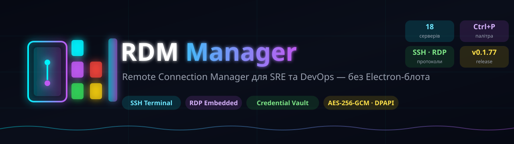
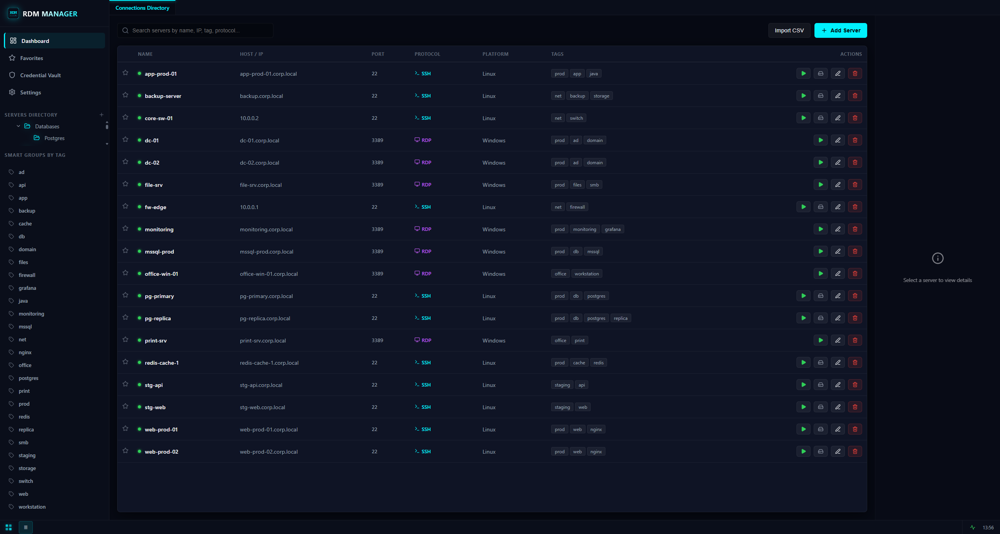
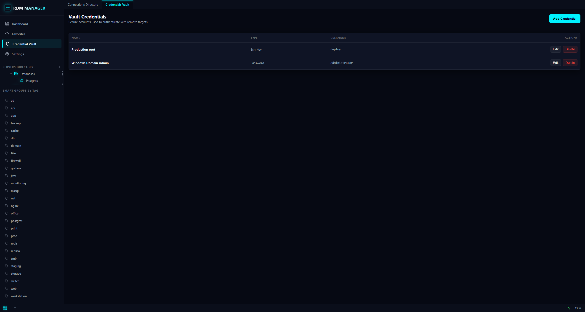

<div align="center">

# RDM Manager — Source Code

[](https://github.com/ajjs1ajjs/RDM)
[](https://ajjs1ajjs.github.io/RDM/)
[](LICENSE)
[](https://github.com/ajjs1ajjs/RDM/actions)

> **Це репозиторій з вихідним кодом RDM Manager remote connection manager.**
> Готовий продукт деплоїться в: **https://github.com/ajjs1ajjs/RDM**
> Офіційний сайт: **https://ajjs1ajjs.github.io/RDM/**

# RDM Manager

### Remote Connection Manager for SRE and DevOps



Легкий, швидкий та безпечний менеджер віддалених підключень для SRE та DevOps інженерів. Побудований на базі Tauri v2, Rust, React та SQLite.

[](https://tauri.app/)
[](https://www.rust-lang.org/)
[](https://react.dev/)
[](LICENSE)

</div>
## 🖼️ Screenshots

<p align="center">
  
  
</p>

---

## 🚀 Основний функціонал
* **SSH-підключення (Linux)**: вбудований термінал на базі `xterm.js` із автоматичною підгонкою розміру сітки, що працює через системний PTY на Rust. Автозаповнення паролів/парольних фраз та робота з тимчасовими файлами приватних ключів (які безслідно видаляються з диска відразу після закриття сесії).
* **RDP-підключення (Windows)**: вбудовані у вкладки додатку RDP-сесії на базі нативного клієнта `mstsc`. Завдяки Win32 reparenting та маніпулюванню стилями вікон, сесія інтегрується безпосередньо у вікно RDM Manager (як у Devolutions RDM) та підтримує плавне масштабування (`smart sizing`) при зміні розмірів вкладки чи приховуванні бічного сайдбара.
* **Сейф облікових записів (Credential Vault)**: безпечне зберігання логінів, паролів та SSH-ключів із AES-256-GCM шифруванням.
* **Командна палітра (Ctrl+P / Ctrl+K)**: швидкий пошук та підключення до будь-якого сервера без миші.
* **Групування та теги**: ієрархічне дерево папок (наприклад, `Production/Linux`) та швидке фільтрування за смарт-тегами.
* **Бекап та відновлення**: експорт та перевірка сумісності (через sentinel-хеш) при імпорті бази даних `rdm.db` для уникнення втрати даних.
* **Імпорт з Devolutions RDM**: парсер CSV-таблиць для міграції всіх налаштувань та облікових записів в один клік.
* **Безпека буфера обміну**: автоматичне очищення буфера обміну через 15 секунд після копіювання паролів для запобігання витоку.

---

## 🖥️ Підтримка платформ

| Платформа | SSH / SFTP | Credential Vault | RDP |
|-----------|-----------|------------------|-----|
| Windows   | ✅         | ✅ (Credential Manager) | ✅ |
| macOS     | ✅         | ✅ (Keychain) | ❌ |

RDP-сесії (вбудований `mstsc`, Win32 reparenting) працюють лише на Windows. На macOS інтерфейс RDP автоматично приховується, а SSH/SFTP та сейф облікових записів повністю функціонують. Розповсюдження: Windows (NSIS/MSI), macOS (.dmg).

---

## 🔒 Архітектура безпеки
1. **KEK (Key Encryption Key)**: Випадковий 256-бітний ключ шифрування генерується локально (OS CSPRNG) і **зберігається в системному сховищі ключів ОС (OS keyring)** — Windows Credential Manager або macOS Keychain. У базі даних зберігається лише маркер використання сховища, а не сам ключ. Існуючі сейфи, створені з Windows DPAPI, автоматично мігруються в ключове сховище при першому запуску.
2. **AES-256-GCM**: Облікові дані шифруються за допомогою симетричного алгоритму AES-256-GCM із випадковим 12-байтовим nonce.
3. **Безпека пам'яті**: Ключ дешифрування тримається виключно в оперативній пам'яті бекенду Rust та миттєво занулюється (zeroized) при виході або блокуванні сейфа.
4. **Sentinel**: Контрольний рядок (`rdm-auth-sentinel`) використовується для перевірки цілісності ключа. База даних не зберігає жодного пароля у відкритому вигляді.
5. **Бекапи**: Експорт/імпорт бази захищаються окремим паролем (PBKDF2-HMAC-SHA256) — це єдиний шлях перенесення даних між машинами (ключ у сховищі ОС прив'язаний до локального користувача).

---

## 🛠️ Стек технологій
* **Core**: Tauri v2, Rust
* **Frontend**: React (TypeScript), CSS
* **Database**: SQLite (через `rusqlite` з `bundled` збіркою)
* **Crypto**: PBKDF2-HMAC-SHA256, AES-256-GCM
* **PTY & Terminal**: `portable-pty` (ConPTY), `xterm.js` + `fit-addon`
* **Utilities**: `rfd` (Rust File Dialogs), `csv`

---

## 💻 Розробка та запуск

### Системні вимоги
Для збірки необхідні встановлені:
* **Node.js** (v20+)
* **Rust & Cargo** (v1.75+)
* **C++ Build Tools** (компілятор MSVC або MinGW на Windows)

### Запуск у режимі розробки
Встановіть залежності та запустіть Tauri-сервер:
```bash
npm install
npm run tauri dev
```

### Збірка релізної версії
Для створення оптимізованого `.exe` файлу та інсталяторів (`.msi` та setup `.exe` через NSIS):
```bash
npm run tauri build
```
Готові файли збірки будуть знаходитись у каталозі `src-tauri/target/release/bundle/`.

### Де зберігається база даних?
Локальний файл бази даних зберігається за шляхом:
`C:\Users\<Ваш_Користувач>\AppData\Roaming\com.admin.rdm-manager\rdm.db`

Увага: файл бази прив'язаний до поточного користувача через **системне сховище ключів ОС (keyring)**. Копіювання файлу працює як бекап на тій самій машині, але для перенесення/синхронізації між пристроями використовуйте **Експорт/Імпорт резервної копії** (Settings → Backup & Restore) — він захищається паролем і не залежить від локального сховища ключів.
